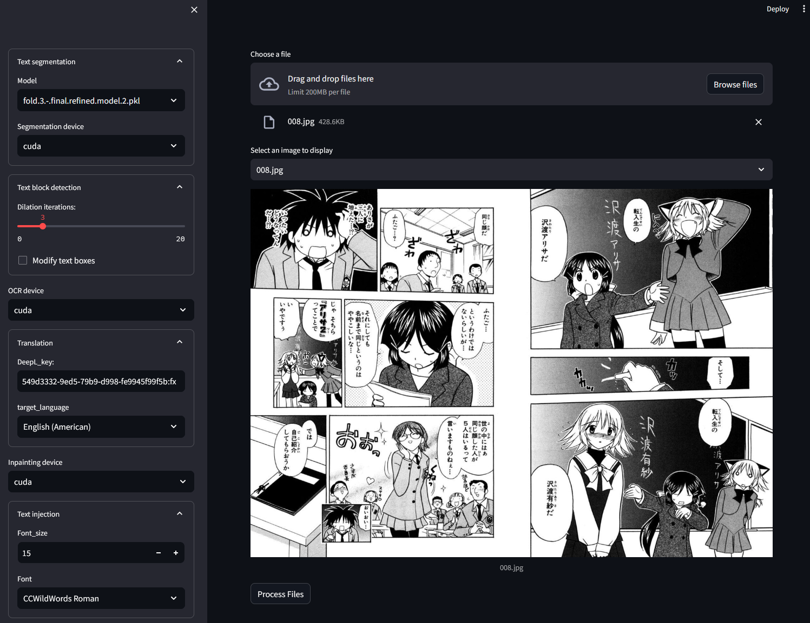
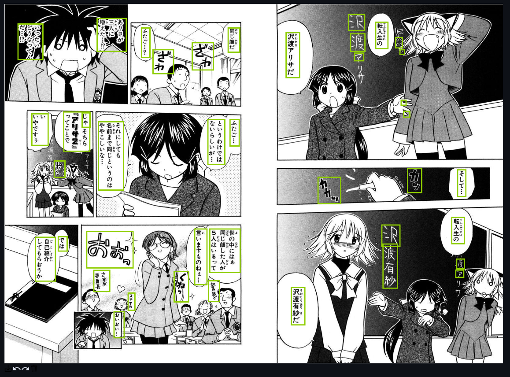

<p align="center">
  
</p>

<h1 align="center" style="font-size: 36px; font-weight: bold; margin-bottom: 20px;">MangaQuick: Automatic Manga Translator</h1>

## Description

MangaQuick is a Streamlit-powered web application, designed to facilitate the automatic translation of manga. This tool is part of my Final Degree Project [Diseño y desarrollo de un traductor de comics](https://oa.upm.es/71255/) (UPM, Spanish). It offers a streamlined solution for translating manga pages, with support for both single-page and batch processing. The application integrates [Manga Text Segmentation](https://github.com/juvian/Manga-Text-Segmentation) for text segmentation and detection, [LaMa](https://github.com/advimman/lama) for image inpainting and [manga-ocr](https://github.com/kha-white/manga-ocr) for optical character recognition.

## Installation

### Prerequisites

It's highly recommended to use a virtual environment for managing dependencies and isolating the project, `conda` is a great tool for this purpose:

Create a new conda environment named 'MangaQuick' with Python 3.11
```bash
conda create --name MangaQuick python=3.11
```

Activate the 'MangaQuick' environment
```bash
conda activate MangaQuick
```

### Step-by-Step Installation

1. Clone the MangaQuick repository:
    ```bash
    git clone https://github.com/yourusername/MangaQuick.git
    ```

2. Navigate to the MangaQuick directory:
    ```bash
    cd MangaQuick
    ```

3. Install the required dependencies:
    ```bash
    pip install -r requirements.txt
    ```
### GPU Support
To utilize GPU, ensure you install the correct version of PyTorch that matches your system and CUDA setup.
You can find the appropriate installation commands on:

[https://pytorch.org/get-started/locally/](https://pytorch.org/get-started/locally/)

This application has been tested on an RTX 3080 GPU, which has 10GB of VRAM. It's important to note that the application nearly utilizes the full capacity of the 10GB VRAM. Therefore, to ensure smooth operation, a GPU with at least 10GB of VRAM is recommended.

The application supports CPU usage as well, with options to select either CPU or GPU for each different model within the web interface. The Text Segmentation model is the most resource-intensive component.

### Text segmentation model

To download the Text Segmentation model, visit the [GitHub repository](https://github.com/juvian/Manga-Text-Segmentation). The repository offers 5 model variants; you may download one or all to switch between them in the web application.

Create a models folder inside components/text_detection and place the downloaded .pkl model file(s) inside it following this directory structure:
```
components/text_detection/models/fold.0.-.final.refined.model.2.pkl
```

### LaMa model

Download the LaMa inpainting model from its [GitHub page](https://github.com/advimman/lama/tree/main) using the following commands:

```bash
curl -LJO https://huggingface.co/smartywu/big-lama/resolve/main/big-lama.zip
unzip big-lama.zip
```

Create a models folder inside components/image_inpainting and move the big-lama folder into it, resulting in the following path:
components/image_inpainting/models/big-lama

## Usage

To start using MangaQuick, follow these steps:

1. Launch the application:
    ```bash
    streamlit MangaQuick.py
    ```
    
Upon launching, you will see the MangaQuick web interface in your browser:


<sup>(source: [manga109](http://www.manga109.org/en/), © Yagami Ken)</sup>

### Main Features

-  **Text segmentation**:  Select the preferred model and the processing unit, either GPU ("cuda") or CPU ("cpu"), to fit your hardware capabilities.
-  **Text block detection**: options for mask dilation and the removal of unnecessary text blocks, particularly useful for reducing false positives.
-  **OCR**: Select either GPU ("cuda") or CPU ("cpu").
-  **Translation**: Enter your DeepL API key and select the desired target language to translate the manga into your preferred language.
-  **Inpainting**: select either GPU ("cuda") or CPU ("cpu").
-  **Text injection**:  Choose the appropriate font size and style. Note you need to match the font style with the target language for a coherent look.

### DeepL

To store your DeepL key, create a .env file and include the following line:
```
DEEPL_KEY=<your_deepl_key>
```

### Modifying Detection Boxes

- Activate the `Modify text boxes` option to enable editing.
- Within the user interface, adjusting detection boxes is straightforward: simply double-click on any box you wish to exclude. This feature is particularly useful for eliminating unnecessary or incorrect detections.
- The functionality is focused solely on the removal of boxes; additional modifications to the boxes are not supported.


<sup>(source: [manga109](http://www.manga109.org/en/), © Yagami Ken)</sup>
 
2. Once the images are processed, you can download the translated manga as a zip file, ready for reading in your chosen language.


## Acknowledgments
- Manga Text Segmenation: [https://github.com/juvian/Manga-Text-Segmentation](https://github.com/juvian/Manga-Text-Segmentation)
- Manga inpainting: [https://github.com/advimman/lama](https://github.com/advimman/lama)
- Manga OCR: [https://github.com/kha-white/manga-ocr](https://github.com/kha-white/manga-ocr)

